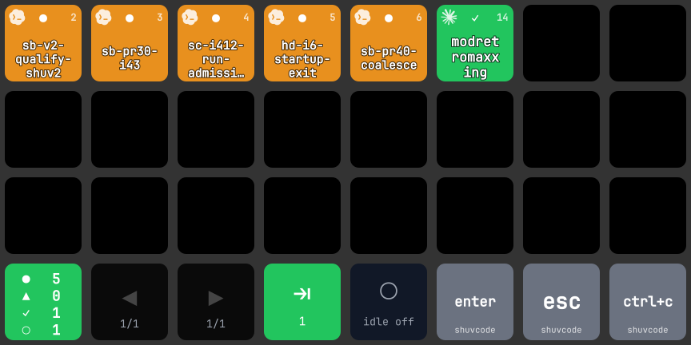

# herdr agents — Stream Deck plugin

Live [herdr](https://herdr.dev) agent status on your Elgato Stream Deck.

See which of your AI coding agents are running, busy, blocked, or finished — at a
glance, on physical keys. Press a key to jump straight to that agent's pane and
bring your terminal to the foreground. Answer the approval dialog an agent is
stuck on without touching the keyboard. No more hunting through tabs to find the
agent that's waiting on you.



## What it does

- **One key per agent.** Each key mirrors a live herdr agent: label + status
  color + a monochrome logo of the agent type (Claude, Codex, OpenCode, …) + the
  workspace number from herdr's sidebar. The herdr-focused pane gets a white ring.
- **Sidebar order.** Agents are laid out in the same order as herdr's workspace
  list, so the deck and the sidebar always agree.
- **Smart labels** — the agent's name if you renamed it (`herdr agent rename`),
  else the workspace label (tells worktree clones of one repo apart), else the
  working directory. Duplicates get `#1`/`#2`.
- **Status at a glance** — color and glyph encode `working` / `blocked` / `done`
  / `idle` (see the table below).
- **Press = focus.** A short press runs `agent.focus` for that pane *and* raises
  the host terminal, so the agent is actually on screen even if the terminal was
  in the background.
- **Long-press = pin.** Holding a key pins the agent — it jumps to the front,
  stays visible even when it goes idle, and gets a pushpin badge. Pins are
  in-memory (reset when the plugin restarts).
- **Agent Input keys.** Send `enter`, `esc`, `y`, `ctrl+c`, … (or a canned
  prompt) to the agent herdr currently has focused. The key is tinted with that
  agent's status, so a red key means "there's a dialog waiting for this".
- **Summary key.** Live counts of working / blocked / done / idle across every
  agent; goes red when anything is blocked.
- **Paging & attention.** Dedicated Prev / Next / "jump to the next blocked or
  done agent" keys — or the original single morphing Pager key for a 6-key Mini.
- **Toggle idle.** Idle agents are hidden by default so a small deck only shows
  what matters; one key flips that when you have 32 keys to fill.
- **Active notifications.** When an agent flips to `blocked` or `done` you get a
  herdr notification with a sound (`request` / `done`) and the key flashes — even
  when you're not looking at the deck.
- **Instant updates.** Refreshes on herdr socket events (push), with a slow
  safety-net poll as a backstop — no busy polling.

## Status → key

| status   | color      | glyph | meaning           |
|----------|------------|-------|-------------------|
| working  | orange     | ●     | running now        |
| blocked  | red        | ▲     | wants you          |
| done      | green      | ✓     | finished, unseen   |
| idle     | grey       | ○     | waiting (hidden)   |
| unknown  | near-black | ·     | —                  |
| empty    | black      |       | no agent in slot   |

## Tested on

- **Stream Deck XL** (8×4) on Linux (Arch / Hyprland) with [OpenDeck](https://github.com/nekename/OpenDeck) 2.14
- **Stream Deck Mini** (6 keys) on macOS 26 with the Elgato Stream Deck app 7.4.2
- **herdr 0.9.1** (API protocol 22)

The plugin is keypad-only and works on any Stream Deck model with keys. Agent
Slot keys number themselves by position, so drop as many as you like anywhere on
the deck.

## Requirements

- [herdr](https://herdr.dev) 0.9+ running (the plugin talks to its API socket
  directly; `herdr` does not need to be on the plugin's `PATH`)
- macOS 12+ with the Elgato Stream Deck app 7.1+, **or** Linux with OpenDeck 2.x
- To build from source: [Bun](https://bun.sh) and Node.js 24

## Install

### From source (Elgato Stream Deck app)

```bash
git clone https://github.com/timvdhoorn/stream-deck-herdr-plugin.git
cd stream-deck-herdr-plugin
bun install
bun run build

# enable Stream Deck developer mode (one-time), then link + start the plugin
bunx streamdeck dev
bunx streamdeck link dev.timvdhoorn.herdr-agents.sdPlugin
bunx streamdeck restart dev.timvdhoorn.herdr-agents
```

### As a packaged plugin

```bash
bun run build
bunx streamdeck pack dev.timvdhoorn.herdr-agents.sdPlugin
```

This writes `dev.timvdhoorn.herdr-agents.streamDeckPlugin` — double-click it to
install into the Stream Deck app.

### Linux (OpenDeck)

```bash
scripts/install-opendeck.sh                      # build, test, install into ~/.config/opendeck/plugins
scripts/install-opendeck.sh --profile --restart  # …plus write the full-deck layout below and restart OpenDeck
```

`--profile` generates an OpenDeck profile named `herdr` for the connected device
(`DEVICE=sd-…` to pick one, `COLUMNS=`/`ROWS=` for a non-XL deck) and selects it;
your previous profile is left untouched. You can also run the generator alone:
`bun scripts/opendeck-profile.ts --device sd-XXXX --write`.

## Layout & usage

Drag actions from the **herdr** category onto your keys. Agent Slot keys number
themselves left-to-right, top-to-bottom (fix a slot number in the Property
Inspector only if you want to override that order).

### Stream Deck XL (what `--profile` writes)

```
[ Slot ][ Slot ][ Slot ][ Slot ][ Slot ][ Slot ][ Slot ][ Slot ]
[ Slot ][ Slot ][ Slot ][ Slot ][ Slot ][ Slot ][ Slot ][ Slot ]
[ Slot ][ Slot ][ Slot ][ Slot ][ Slot ][ Slot ][ Slot ][ Slot ]
[Summary][ Prev ][ Next ][Attn.][Idle ][enter ][ esc  ][ctrl+c]
```

24 agents per page, with the control strip on the bottom row.

### Stream Deck Mini

```
[ Slot ][ Slot ][ Slot ]
[ Slot ][ Slot ][Pager ]
```

The **Pager** in `auto` mode is one key with two jobs: when any agent is blocked
or done it jumps to the next one needing attention (cycling on repeat presses);
otherwise it pages through the grid.

### Actions

| action | press | settings |
|--------|-------|----------|
| **Agent Slot** | short: focus pane + raise terminal · long: pin/unpin | slot: auto / 1–32 |
| **Pager** | depends on mode | mode: auto · next · prev · attention |
| **Summary** | raise terminal on the focused agent + refresh | — |
| **Toggle Idle** | show/hide idle agents | — |
| **Agent Input** | send keys or a prompt to the focused agent | mode, keys (`enter`, `esc`, `y`, `1`, `ctrl+c`, …), prompt text, label |

Agent Input uses herdr's `agent.send_keys` / `agent.prompt`: keys are validated
before any bytes are written, and a prompt is refused while the agent sits in an
approval dialog (the key shows an alert instead).

## Configuration

| Env var | Default | Purpose |
|---------|---------|---------|
| `HERDR_SOCKET_PATH` | herdr's default | Path to the herdr API socket (same override herdr itself honors). |
| `HERDR_SESSION` | — | Use a named herdr session's socket instead of the default session. |
| `HERDR_DECK_TERMINAL_APP` | `iTerm` | macOS: AppleScript name of the terminal hosting herdr (`Terminal`, `Ghostty`, `WezTerm`, …). |
| `HERDR_DECK_HYPRLAND_TITLE` | `^<hostname>: .*` | Linux/Hyprland: full-match regex for the herdr window title (herdr's default title is `{hostname}: {workspace}`). Set to `""` to match by class instead. |
| `HERDR_DECK_HYPRLAND_CLASS` | `com.mitchellh.ghostty` | Linux/Hyprland: window class used when the title filter is empty. |
| `HERDR_DECK_LOG` | `info` | Set to `debug` for slot-assignment logging. |
| `HERDR_DECK_FONT_FAMILY`, `HERDR_DECK_LABEL_SIZE`, `HERDR_DECK_LABEL_COLS`, `HERDR_DECK_LABEL_LINES` | JetBrains Mono · 30 · 6 · 3 | Key label typography. |

## How it works

The plugin speaks herdr's JSON API over its Unix socket (one request per
connection, as the server implements it): `session.snapshot` for agents plus the
ordered workspace list, `agent.focus`, `agent.send_keys`, `agent.prompt`,
`notification.show`. A single `events.subscribe` stream delivers pane/workspace
topology events plus a per-pane `pane.agent_status_changed` subscription for
every known agent pane; the subscription is re-issued whenever the pane set
changes. A store normalizes the snapshot and notifies every action to re-render.

All herdr I/O is isolated in `src/herdr/*` (injectable `request` for tests), the
pure logic lives in `src/core/*` (unit-tested with `bun test`), and the Stream Deck
actions in `src/actions/*` are thin glue. Key images are rendered as base64 SVG
data URIs for crisp text at any key size.

## Development

```bash
bun test                    # run the unit tests
bunx tsc --noEmit           # type-check
bun run build               # bundle to …/bin/plugin.js
bun run watch               # rebuild + restart the plugin on change (Elgato app)
scripts/install-opendeck.sh --restart   # rebuild + reinstall + restart (OpenDeck)
```

## License

[MIT](LICENSE) © Tim van der Hoorn
